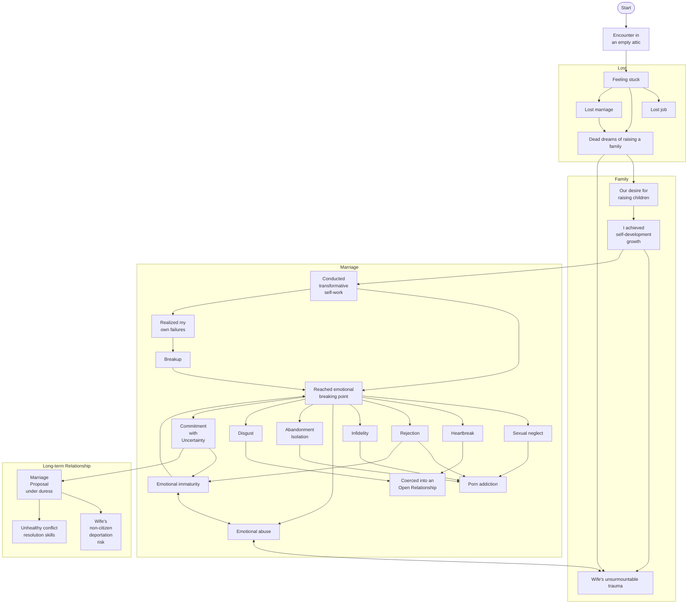

## Instructions
How to use the provided story graph:
- Edges = Treat directionality as plot continuity, as if answering "because..." into the next node. Treat nodes with multiple edges as complimenting narrative, as if stating "and..." into the connected nodes.
- Bidirectional Edges = Treat the same as edges, but preserve progression by avoiding recursive loops, discard node-revisits.
- Subgraphs = Story chapters. Each chapter represents a thematic progression of the story.

## Graph
