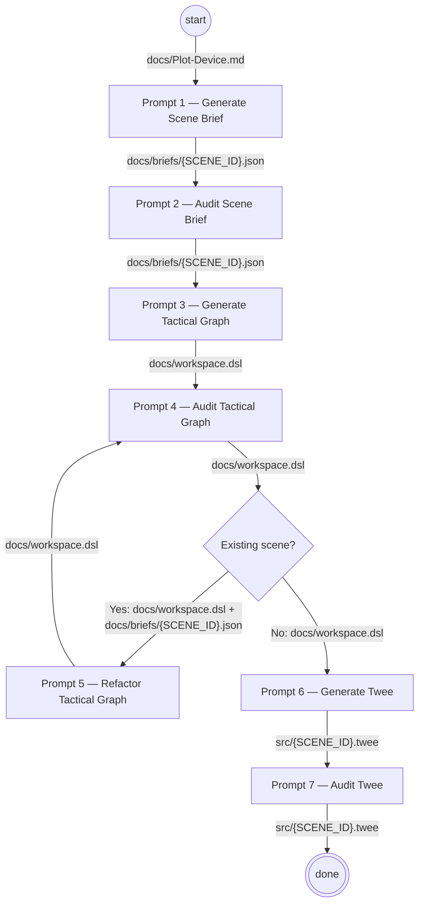

# Strangers In The Attic
 

A Twine narrative prototype.

> **ℹ️ Note:**  
> See the playable [demo site](https://kilogold.github.io/TwineListen/).
> 

## Key development constraints
1. The game has only two mechanics: gaze & listen.
2. Focus on emotional storytelling and psychological thriller.
3. Apply principles from "Aesthetics of Play" for narrative content.

## Game features
- Player perspective: First-person.
- Single NPC actor: a frail and melancholic elderly man named Leon.
- Player actor: a mysterious humanoid physical entity that keeps respawning.
- Static environment: dark attic setting.
- Core gameplay revolves around careful NPC + environment observation & listening.
- NPC is subject to attack the player if he feels misunderstood, judged, or ignored.
- Game over unlocks new progressive story passages.
- The story has multiple endings based on player interactions & NPC reactions.
- Player only nods and listens.

## Project structure
- [src](/src/): All Twee files for Twine narrative.
- [docs](/docs/): Story context for narrative generation. 
- [include](/include/): Assets bundled with the build.
- [tools](/tools/): Misc automations for development.
- [.cursor](/.cursor/): LLM generation rules for [Tactical Graph](/docs/workspace.dsl).

## AI Workflow
See [workflow](/docs/Workflow.md) for implementation details:

### Tested recommended models per prompt
| Model         | P1 | P2 | P3 | P4 | P5 | P6 | P7 |
|---------------|----|----|----|----|----|----|----|
| GPT 5.4       | ✓  |    | ✓  |    | ✓  | ✓  |    |
| Opus 4.6      | ✓  |    | ✓  |    | ✓  | ✓  |    |
| Sonnet 4.6    |    | ✓  |    | ✓  |    |    | ✓  |
| GPT 5.3 Codex |    | ✓  |    | ✓  |    |    | ✓  |
